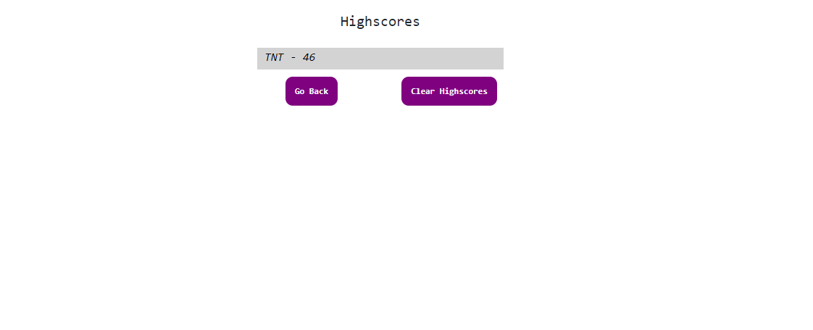

# CodeQuiz - Homework Assignment

# 04 Web APIs: Code Quiz
Complete a coding assessment that renders a combination of multiple-choice questions and interactive challenges. It is a timed code quiz with multiple-choice questions. This app runs in the browser and feature dynamically updated HTML and CSS powered by JavaScript code. It features a clean and polished user interface and be responsive, ensuring that it adapts to multiple screen sizes.

## User Story

```
AS A coding bootcamp student
I WANT to take a timed quiz on JavaScript fundamentals that stores high scores
SO THAT I can gauge my progress compared to my peers
```

## Acceptance Criteria

```
GIVEN I am taking a code quiz
WHEN I click the start button
THEN a timer starts and I am presented with a question
WHEN I answer a question
THEN I am presented with another question
WHEN I answer a question incorrectly
THEN time is subtracted from the clock
WHEN all questions are answered or the timer reaches 0
THEN the game is over
WHEN the game is over
THEN I can save my initials and score
```





### Deliverables

* The URL of the functional, deployed application.

* The URL of the GitHub repository with a unique name and README describing the project.

- - -
© 2019 Trilogy Education Services, a 2U, Inc. brand. All Rights Reserved.
